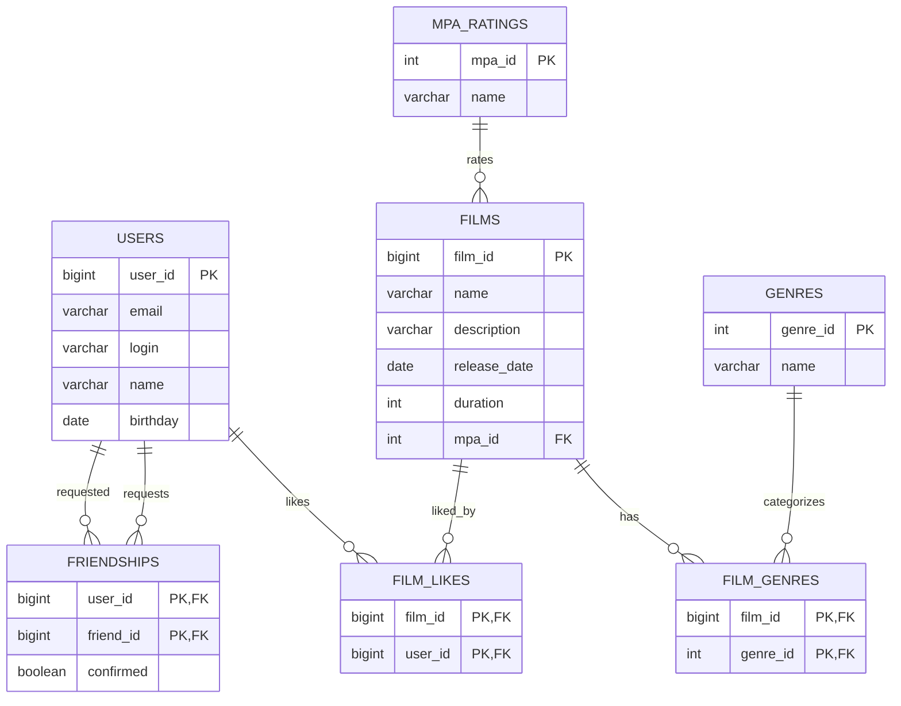

# java-filmorate

Приложение для работы с фильмами и оценками пользователей: добавление фильмов и
пользователей, лайки, дружба, рейтинги MPA и жанры. Данные хранятся в БД H2
(в рабочем режиме — в файле, в тестах — в памяти).

## Схема базы данных



Дружба односторонняя: запись `friendships (user_id, friend_id)` означает, что
`user_id` добавил `friend_id`. Обратная связь возникает только при ответной заявке.

## Примеры запросов

Топ-10 популярных фильмов по числу лайков:

```sql
SELECT f.film_id, f.name, COUNT(fl.user_id) AS likes
FROM films f
LEFT JOIN film_likes fl ON f.film_id = fl.film_id
GROUP BY f.film_id, f.name
ORDER BY likes DESC
LIMIT 10;
```

Список друзей пользователя:

```sql
SELECT u.*
FROM users u
JOIN friendships f ON u.user_id = f.friend_id
WHERE f.user_id = ?;
```

Общие друзья двух пользователей:

```sql
SELECT u.*
FROM users u
JOIN friendships f1 ON u.user_id = f1.friend_id AND f1.user_id = ?
JOIN friendships f2 ON u.user_id = f2.friend_id AND f2.user_id = ?;
```
